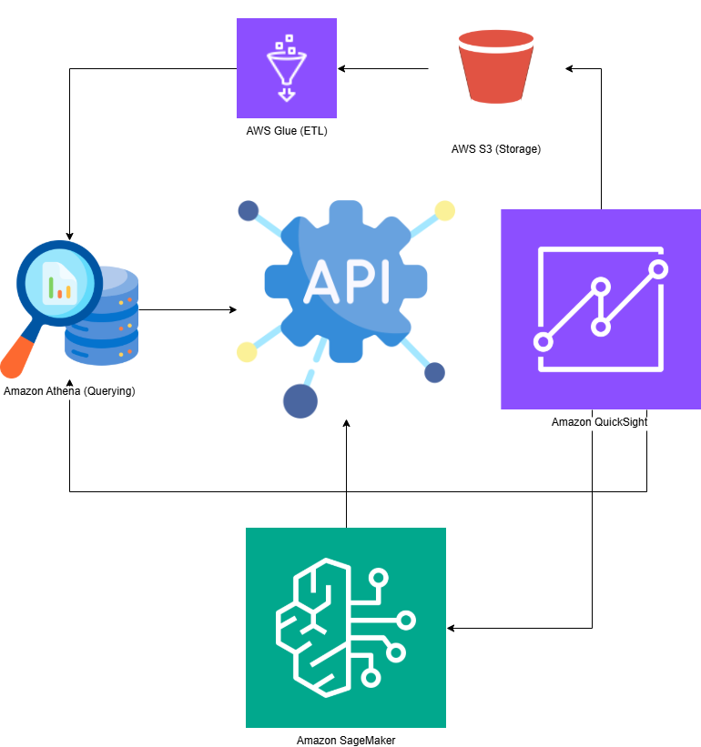

# AWS Data Pipeline
Det här är innehållet i min README-fil.

# AWS Data Pipeline for Analytics and Machine Learning

## Syfte
Det här projektet implementerar en fullständig data-pipeline för att extrahera, transformera och analysera stora datamängder med hjälp av AWS-tjänster som Glue, Athena och SageMaker.

## Installation

1. **Förutsättningar**: Se till att du har följande tjänster konfigurerade i ditt AWS-konto:
   - **Amazon S3**: För lagring av data.
   - **AWS Glue**: För ETL-processer.
   - **Amazon Athena**: För SQL-frågor på S3-data.
   - **Amazon SageMaker**: För maskininlärning.

2. **Klona projektet**:
    ```bash
    git clone https://github.com/DianaFlodin/AWS-Data-pipeline.git
    ```

3. **Installera nödvändiga bibliotek** (om det finns några specifika bibliotek i ditt projekt):
    ```bash
    pip install -r requirements.txt
    ```

4. **Konfigurera dina AWS-tjänster**:
   - Skapa en **S3-bucket**.
   - Skapa en **IAM-roll** med rättigheter för Glue, Athena och SageMaker.
   - Konfigurera **Athena** och **Glue** för att arbeta med din S3-bucket.

5. **Kör projektet**: Följ instruktionerna för att använda AWS-konsolen eller CLI för att köra projektet.
   - Uppdatera eventuellt `config.json` eller motsvarande med din AWS-konfiguration.




---

## Hur man kör projektet

För att köra projektet och exekvera pipelinen, följ dessa steg:

### 1. **Kör Glue-jobben**
För att köra Glue-jobben (dataextraktion och transformation), använd AWS Glue Console eller AWS CLI.

**Exempel på Glue-jobbskod** (`data_extraction.py`):
```python
import boto3

# Skapa en Glue-klient
glue_client = boto3.client('glue', region_name='us-west-2')

# Exekvera Glue-jobb
response = glue_client.start_job_run(JobName='MyGlueJob')
print(f"Jobb startad: {response['JobRunId']}")